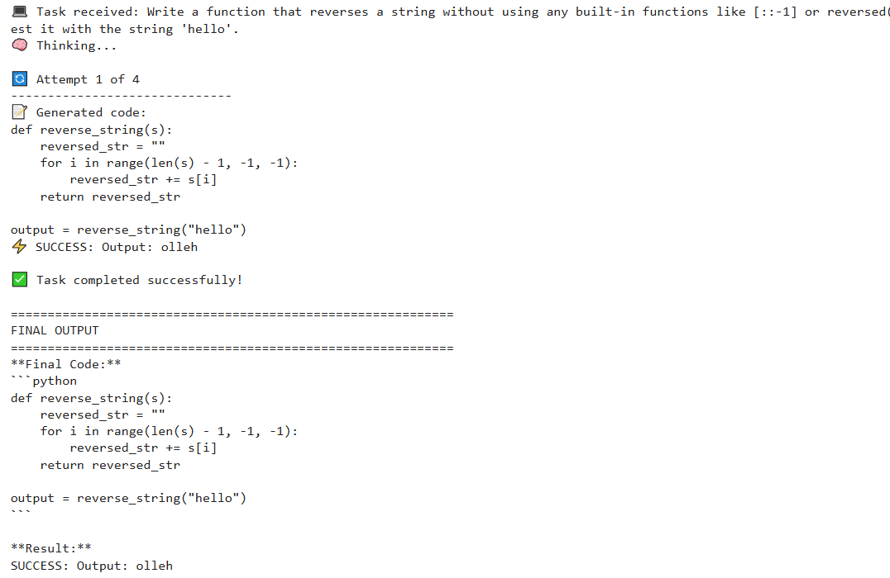

# AI Coding Partner Agent 💻

An advanced AI agent that demonstrates iterative reasoning (ReAct pattern) by writing, executing, and debugging code to solve programming tasks.

## 🚀 Features

- **ReAct Pattern:** Implements a Reason-Act-Observe feedback loop for autonomous problem-solving.
- **Tool Use:** Uses a safe Python execution environment to test its own code.
- **Iterative Debugging:** Analyzes errors and iteratively improves its code until the task is solved.
- **Autonomy:** Requires only a high-level task description to generate working code.

## 🛠️ Tech Stack

- **Python**
- **Google Gemini API** (`gemini-1.5-flash`)
- **Google Colab** (for execution)

## 📸 Demo

**Live Demo:** [https://colab.research.google.com/drive/1qL_Vxi8whsMX8ft5-Ho2F2-mCs5-Ix8V?usp=sharing]

*Example: The agent successfully writing a prime number function on its first attempt:*
 

## 🏗️ How It Works

1.  **Reason:** The LLM plans a solution and writes Python code.
2.  **Act:** The code is executed in a controlled environment using `exec()`.
3.  **Observe:** The output or error is captured and analyzed.
4.  **Loop:** Steps 1-3 repeat until the task is solved or a maximum attempt limit is reached.

## 📁 Project Structure
ai-coding-agent/

├── ai_coding_agent.ipynb # Main project notebook

├── requirements.txt # Project dependencies


├── README.md # This file


## 🔧 Setup and Installation

1. Clone the repository:
```bash
git clone https://github.com/HassanYousafzai/ai-coding-agent.git
Install the required packages:

bash
pip install -r requirements.txt
Set up your API key for Google AI Studio as an environment variable.

🚦 Usage
The project is designed to run in Google Colab. Open the ai_coding_agent.ipynb notebook in Colab, add your API key using the secrets manager, and run all cells.
